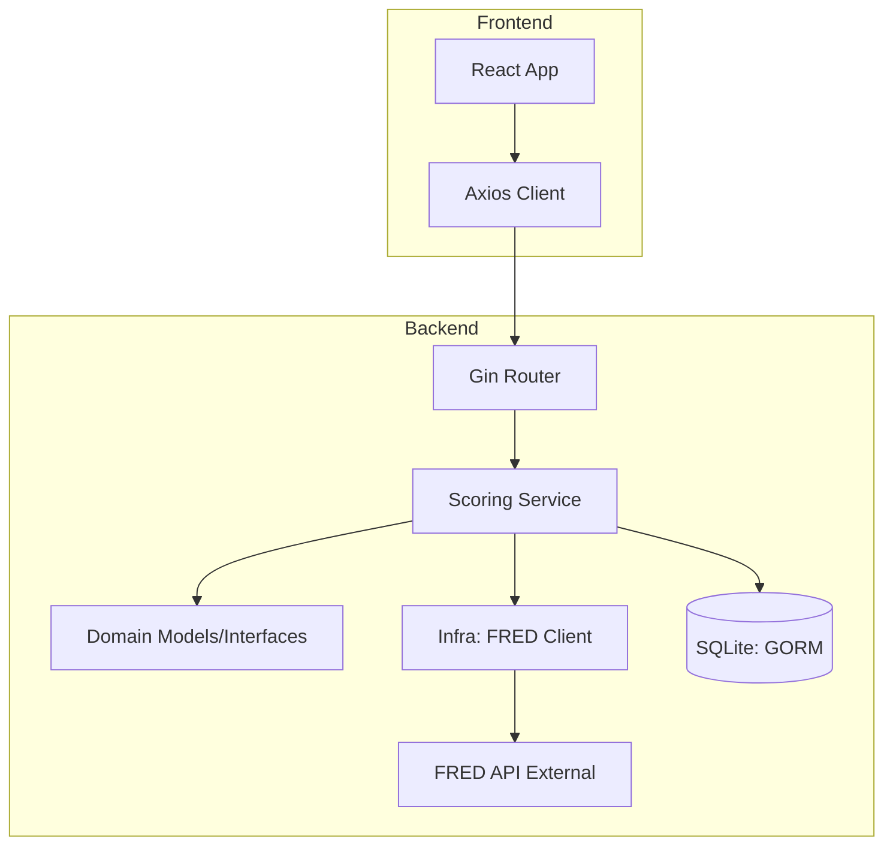

# ARCHITECTURE.md

본 문서는 USA Liquidity Dashboard의 시스템 설계, 계층 구조 및 데이터 흐름을 정의합니다.

## 1. 전제적인 시스템 구조

Clean Architecture 원칙을 준수하여 도메인 논리와 인프라를 분리합니다.

## 2. 계층별 책임

### 2.1 Backend (Go)

- **`cmd/` 또는 `server/main.go`**: 애플리케이션 엔트리 포인트. DI 설정, DB 초기화, 백그라운드 스케줄러 실행 및 HTTP 서버 구동.
- **`internal/domain`**: 핵심 엔티티(`Metric`, `ScoreResult`) 및 가중치 정의. 프레임워크 비의존적 계층.
- **`internal/app`**: 비즈니스 로직(`ScoringService`). FRED 데이터를 바탕으로 11개 지표 점수 산정 및 레짐 판별 수행.
- **`internal/infra`**: 외부 의존성 처리. FRED API 연동(`FredClient`) 및 SQLite 데이터베이스 연동.

### 2.2 Frontend (React)

- **`client/src/App.jsx`**: 메인 대시보드 UI 및 상태 관리. 5분 주기로 백엔드 API를 호출하여 데이터 동기화.
- **`client/src/components/`**: 재사용 가능한 UI 컴포넌트 (`MetricCard`, `MiniChart`).
- **`client/src/index.css`**: 다크 모드 기반의 프리미엄 디자인 시스템 토큰 정의.

## 3. 데이터 흐름

1. **데이터 수집**: 백그라운드 고루틴이 5분마다 FRED API로부터 11개 주요 지표의 최신 데이터를 수집합니다.
2. **점수 산정**: 수집된 데이터를 `Score Standard.md` 기준에 따라 0-10점으로 매핑하고, 가중합을 산출하여 0-100점의 종합 점수를 생성합니다.
3. **레짐 판별**: 종합 점수 및 특정 필터링 규칙(은행 준비금, M2 등)에 따라 현재 시장을 완화·중립·긴축 상태로 분류합니다.
4. **시각화**: 프론트엔드에서 `/api/status` 엔드포인트를 호출하여 결과를 수신하고, 도넛 차트 및 지표 카드로 시각화합니다.

## 4. 데이터베이스 스키마

- **`metrics`**: 각 시리즈 ID별 시계열 데이터 저장. (ID, SeriesID, Value, Date)
- **`score_results`**: 계산된 종합 점수 및 레짐 판별 이력 저장. (TotalScore, Regime, MetricsJSON, CalculatedAt)
